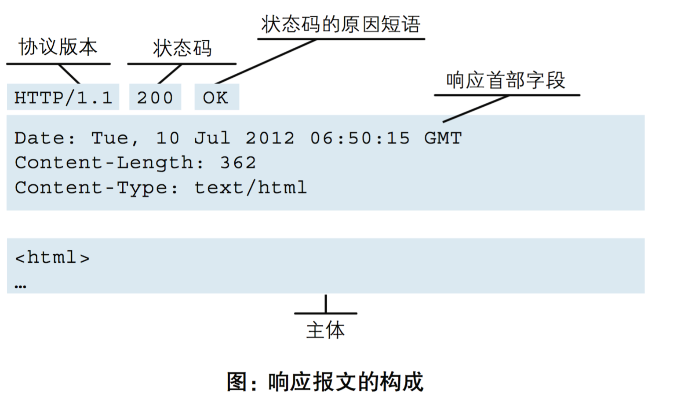

# GoFrame的HTTP客户端

## 一、HTTP协议介绍

超文本传输协议（英文：**H**yper**T**ext **T**ransfer **P**rotocol，缩写：HTTP）是一种用于分布式、协作式和超媒体信息系统的应用层协议。HTTP是万维网的数据通信的基础。

请求：


响应：



放问GF启动的网址，通过Chrome F12查看NetWork中的URL；


**优点：简单方便，浏览器支持完善，工具链成熟；**

## 二、GF的HTTP客户端

我们来看几个HTTP客户端请求的例子：

1. 发送`GET`请求，并打印出返回值

   ```go
    if response, err := ghttp.Get("https://goframe.org"); err != nil {
        panic(err)
    } else {
        defer response.Close()
        fmt.Println(response.ReadAllString())
    }
   ```

2. 发送`GET`请求，下载远程文件

   ```go
    if response, err := ghttp.Get("https://goframe.org/cover.png"); err != nil {
        panic(err)
    } else {
        defer response.Close()
        gfile.PutBytes("/Users/john/Temp/cover.png", response.ReadAll())
    }
   ```

   下载文件操作，小文件下载非常简单。需要注意的是，如果远程文件比较大时，服务端会分批返回数据，因此会需要客户端发多个`GET`请求，每一次通过`Header`来请求分批的文件范围长度，感兴趣的同学可自行研究相关细节。

3. 发送`POST`请求，并打印出返回值

   ```go
    if response, err := ghttp.Post("http://127.0.0.1:8199/form", "name=john&age=18"); err != nil {
        panic(err)
    } else {
        defer response.Close()
        fmt.Println(response.ReadAllString())
    }
   ```

   传递多参数的时候用户可以使用`&`符号进行连接，注意参数值往往需要通过`gurl.Encode`编码一下。

4. 发送`POST`请求，参数为`map`类型，并打印出返回值

   ```go
    if response, err := ghttp.Post("http://127.0.0.1:8199/form", g.Map{
        "submit"   : "1",
        "callback" : "http://127.0.0.1/callback?url=http://baidu.com",
    })); err != nil {
        panic(err)
    } else {
        defer response.Close()
        fmt.Println(response.ReadAllString())
    }
   ```

   传递多参数的时候用户可以使用`&`符号进行连接，也可以直接使用`map`（其实之前也提到，任意数据类型都支持，包括`struct`）。

5. 发送`POST`请求，参数为`JSON`数据，并打印出返回值

   ```go
    if response, err := ghttp.Post("http://127.0.0.1:8199/api/user", `{"passport":"john","password":"123456","password-confirm":"123456"}`); err != nil {
        panic(err)
    } else {
        defer response.Close()
        fmt.Println(response.ReadAllString())
    }
   ```

   可以看到，通过`ghttp`客户端发送`JSON`数据请求非常方便，直接通过`Post`方法提交即可，客户端会自动将请求的`Content-Type`设置为`application/json`。

6. 发送`DELETE`请求，并打印出返回值

   ```go
    if response, err := ghttp.Delete("http://127.0.0.1:8199/user", "10000"); err != nil {
        panic(err)
    } else {
        defer response.Close()
        fmt.Println(response.ReadAllString())
    }
   ```

## 三、客户端自定义Header

1. 使用`SetHeader`方法

   ```go
    package main
   
    import (
        "fmt"
        "github.com/gogf/gf/net/ghttp"
    )
   
    func main() {
        c := ghttp.NewClient()
        c.SetHeader("Cookie", "name=john; score=100")
        if r, e := c.Get("http://127.0.0.1:8199/"); e != nil {
            panic(e)
        } else {
            fmt.Println(r.ReadAllString())
        }
    }
   ```

   通过`ghttp.NewClient()`创建一个自定义的http请求客户端对象，并通过`c.SetHeader("Cookie", "name=john; score=100")`设置自定义的Cookie，这里我们设置了两个示例用的Cookie参数，一个`name`，一个`score`，注意多个Cookie参数使用`;`符号分隔。

2. 使用`SetHeaderRaw`方法

   这个方法更加简单，可以通过原始的Header字符串来设置客户端请求Header。

   ```go
    c := ghttp.NewClient()
    c.SetHeaderRaw(`
        accept-encoding: gzip, deflate, br
        accept-language: zh-CN,zh;q=0.9,en;q=0.8
        referer: https://idonottell.you
        cookie: name=john; score=100
        user-agent: my test http client
    `)
    if r, e := c.Get("http://127.0.0.1:8199/"); e != nil {
        panic(e)
    } else {
        fmt.Println(r.ReadAllString())
    }
   ```