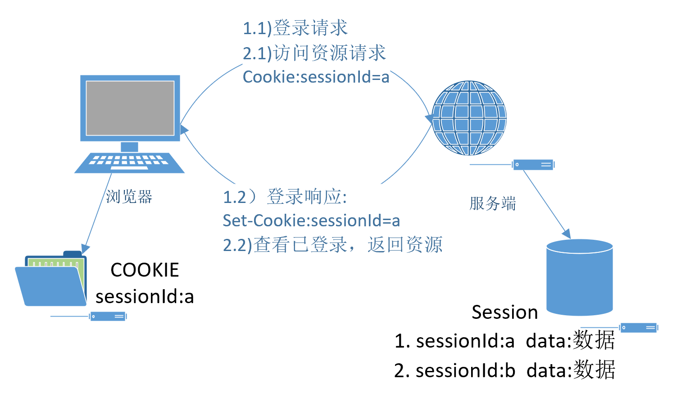

# GoFrame实战之登录的session使用

## 一、概念介绍

`GF`框架提供了完善的`Session`管理能力，由`gsession`模块实现。由于`Session`机制在`HTTP`服务中最常用，因此后续章节中将着重以`HTTP`服务为示例介绍`Session`的使用。

### HTTP

超文本传输协议（英文：**H**yper**T**ext **T**ransfer **P**rotocol，缩写：HTTP）是一种用于分布式、协作式和超媒体信息系统的应用层协议。HTTP是万维网的数据通信的基础。**http是一个简单的请求-响应协议，它通常运行在TCP之上。HTTP是无状态的。**

### cookie

Cookie，有时也用其复数形式 Cookies。类型为“小型文本文件”，是某些网站为了辨别用户身份，进行Session跟踪而储存在用户本地终端上的数据（通常经过加密），由用户客户端计算机暂时或永久保存的信息 。


**Cookie 是一个请求首部，**其中含有先前由服务器通过 Set-Cookie  首部投放并存储到客户端的 HTTP cookies。

这个首部可能会被完全移除，例如在浏览器的隐私设置里面设置为禁用cookie。

```
Cookie: <cookie-list>
Cookie: name=value
Cookie: name=value; name2=value2; name3=value3
```

响应首部 **`Set-Cookie`** 被用来由服务器端向客户端发送 cookie

```
# 设置cookie
Set-Cookie: <cookie-name>=<cookie-value> 
# cookie的最长有效时间
Set-Cookie: <cookie-name>=<cookie-value>; Expires=<date>
# 在cookie失效之前需要经过的秒数；
# 假如二者 （指 Expires 和Max-Age） 均存在，那么 Max-Age 优先级更高
Set-Cookie: <cookie-name>=<cookie-value>; Max-Age=<non-zero-digit>
# 指定 cookie 可以送达的主机名
Set-Cookie: <cookie-name>=<cookie-value>; Domain=<domain-value>
# 指定一个 URL 路径，这个路径必须出现在要请求的资源的路径中才可以发送 Cookie 首部
Set-Cookie: <cookie-name>=<cookie-value>; Path=<path-value>
# 一个带有安全属性的 cookie 只有在请求使用SSL和HTTPS协议的时候才会被发送到服务器
Set-Cookie: <cookie-name>=<cookie-value>; Secure
# 设置了 HttpOnly 属性的 cookie 不能使用 JavaScript 经由  Document.cookie 属性、XMLHttpRequest 和  Request APIs 进行访问，以防范跨站脚本攻击（XSS）
Set-Cookie: <cookie-name>=<cookie-value>; HttpOnly
```

### session

Session：在计算机中，尤其是在网络应用中，称为“会话控制”。

Session是另一种记录客户状态的机制，不同的是Cookie保存在客户端浏览器中，而Session保存在服务器上。客户端浏览器访问服务器的时候，服务器把客户端信息以某种形式记录在服务器上。这就是Session。客户端浏览器再次访问时只需要从该Session中查找该客户的状态就可以了。

### sessionId

当用户发送请求的时候，服务器将用户cookie里面记录的session_id和服务器内存中存放的session_id进行比对，从而找到用户相对应的session进行操作。

 在tomcat中session id中用JSESSIONID来表示；

### cookie与session关系



1. 登录页面输入账号密码请求；服务端认证通过，存储session，设置Cookie；
2. 请求资源需要的资源；服务端查看sessionId，判断sessionId是否存在，存在人为已登录返回资源；

## 存储实现方式

`gsession`实现并为开发者提供了常见的三种`Session`存储实现方式：

1. 基于文件存储（默认）：单节点部署方式下比较高效的持久化存储方式；
2. 基于纯内存存储：性能最高效，但是无法持久化保存，重启即丢失；
3. 基于`Redis`存储：远程`Redis`节点存储`Session`数据，支持应用多节点部署；

代码:

```bash
s := g.Server()
// 设置文件
s.SetConfigWithMap(g.Map{
	"SessionStorage": gsession.NewStorageFile("/tmp"),
})
// 设置内存
s.SetConfigWithMap(g.Map{
	"SessionStorage": gsession.NewStorageMemory(),
})
// 设置redis
s.SetConfigWithMap(g.Map{
	"SessionStorage": gsession.NewStorageRedis(g.Redis()),
})
```

## GSession示例

### 目录

```bash
:.
│  go.mod
│  go.sum
│  main.go
│
├─config
│      config.toml
│
├─gession
│  └─default
│          C1YHTZWK7PS0AEN9VA
│
├─template
│      index.html
│      user_index.html
│
└─test
        test.http
```

### main.go

```bash
package main

import (
	"github.com/gogf/gf/frame/g"
	"github.com/gogf/gf/net/ghttp"
	"github.com/gogf/gf/os/gsession"
)

const SessionUser = "SessionUser"

func main() {
	s := g.Server()

	// 设置存储方式
	sessionStorage := g.Config().GetString("SessionStorage")
	if sessionStorage=="redis" {
		s.SetConfigWithMap(g.Map{
			"SessionStorage": gsession.NewStorageRedis(g.Redis()),
		})
	} else if sessionStorage=="memory" {
		s.SetConfigWithMap(g.Map{
			"SessionStorage": gsession.NewStorageMemory(),
		})
		gsession.NewStorageFile("/tmp")
	}

	// 常规注册
	group := s.Group("/")
	group.GET("/", func(r *ghttp.Request) {
		r.Response.WriteTpl("index.html", g.Map{
			"title": "登录页面",
		})
	})
	group.POST("/login", func(r *ghttp.Request) {
		username := r.GetString("username")
		password := r.GetString("password")

		//dbUsername := "admin"
		//dbPassword := "123456"
		dbUsername := g.Config().GetString("username")
		dbPassword := g.Config().GetString("password")
		if username == dbUsername && password == dbPassword {
			// 添加session
			r.Session.Set(SessionUser, g.Map{
				"username": dbUsername,
				"name":     "管理员",
			})
			r.Response.WriteJson(g.Map{
				"code": 0,
				"msg":  "登录成功",
			})
			r.Exit()
		}

		r.Response.WriteJson(g.Map{
			"code": -1,
			"msg":  "登录失败",
		})
	})

	// 用户组
	userGroup := s.Group("/user")
	userGroup.Middleware(MiddlewareAuth)
	userGroup.GET("/index", func(r *ghttp.Request) {
		r.Response.WriteTpl("user_index.html", g.Map{
			"title": "登录页面",
		})
	})
	userGroup.POST("/list", func(r *ghttp.Request) {
		r.Response.WriteJson(g.Map{
			"code": 0,
			"msg":  "成功",
			"data": g.List{
				g.Map{
					"date":    "2020-04-01",
					"name":    "朱元璋",
					"address": "江苏110号",
				},
				g.Map{
					"date":    "2020-04-02",
					"name":    "徐达",
					"address": "江苏111号",
				},
				g.Map{
					"date":    "2020-04-03",
					"name":    "李善长",
					"address": "江苏112号",
				},
			}})
	})
	userGroup.POST("/logout", func(r *ghttp.Request) {
		// 删除session
		r.Session.Remove(SessionUser)

		r.Response.WriteJson(g.Map{
			"code": 0,
			"msg":  "登出成功",
		})
	})

	s.SetPort(8199)
	s.Run()
}

// 认证中间件
func MiddlewareAuth(r *ghttp.Request) {
	if r.Session.Contains(SessionUser) {
		r.Middleware.Next()
	} else {
		// 获取用错误码
		r.Response.WriteJson(g.Map{
			"code": 403,
			"msg":  "您访问超时或已登出",
		})
	}
}
```

### config.toml

```toml
# 账号
username = "admin"
# 密码
password = "123456"

# session存储方式file,memory,redis
# SessionStorage = "file"

[server]
    Address          = ":8199"
    SessionIdName    = "gSessionId"
    SessionPath      = "./gession"
    SessionMaxAge    = "1m"
    DumpRouterMap    = true

# 模板引擎配置
[viewer]
    Path        = "template"
    DefaultFile = "index.html"
    Delimiters  =  ["${", "}"]
```

### index.html

```html
<!DOCTYPE html>
<html>
<head>
    <meta charset="UTF-8">
    <!-- import CSS -->
    <link rel="stylesheet" href="https://unpkg.com/element-ui/lib/theme-chalk/index.css">
    <style>
        .el-row {
            margin-bottom: 20px;
        }
    </style>
</head>
<body>
<div id="app">
    <el-row>
        <el-col :span="6" :offset="6" style="text-align: center">
            <span>${ .title }</span>
        </el-col>
    </el-row>
    <el-row>
        <el-col :span="6" :offset="6">
            <el-input v-model="username" placeholder="请输入内容"></el-input>
        </el-col>
    </el-row>
    <el-row>
        <el-col :span="6" :offset="6">
            <el-input placeholder="请输入密码" v-model="password" show-password></el-input>
        </el-col>
    </el-row>
    <el-row>
        <el-col :span="6" :offset="6" style="text-align: center">
            <el-button @click="login">登录</el-button>
        </el-col>
    </el-row>


</div>
</body>
<!-- import Vue before Element -->
<script src="https://unpkg.com/vue/dist/vue.js"></script>
<!-- import JavaScript -->
<script src="https://unpkg.com/element-ui/lib/index.js"></script>

<script src="https://cdn.bootcss.com/axios/0.19.2/axios.min.js"></script>

<script>
    new Vue({
        el: '#app',
        data: function () {
            return {
                visible: false,
                username: '',
                password: ''
            }
        },
        methods: {
            login: function () {
                axios.post('/login', {       // 还可以直接把参数拼接在url后边
                    username: this.username,
                    password: this.password
                }).then(function (res) {
                    console.log(res.data)
                    if (res.data.code == 0) {
                        alert(res.data.msg)
                        window.location.href = "/user/index"
                    } else {
                        alert("失败：" + res.data.msg)
                    }
                }).catch(function (error) {
                    console.log(error);
                });
            }
        }
    })
</script>
</html>
```

### user_index.html

```html
<!DOCTYPE html>
<html>
<head>
    <meta charset="UTF-8">
    <!-- import CSS -->
    <link rel="stylesheet" href="https://unpkg.com/element-ui/lib/theme-chalk/index.css">
    <style>
        .el-row {
            margin-bottom: 20px;
        }
    </style>
</head>
<body>
<div id="app">
    <el-row>
        <el-col :span="24">
            <template>
                <el-table
                        :data="tableData"
                        style="width: 100%">
                    <el-table-column
                            prop="date"
                            label="日期"
                            width="180">
                    </el-table-column>
                    <el-table-column
                            prop="name"
                            label="姓名"
                            width="180">
                    </el-table-column>
                    <el-table-column
                            prop="address"
                            label="地址">
                    </el-table-column>
                </el-table>
            </template>
        </el-col>
    </el-row>
    <el-row>
        <el-col :span="6" :offset="6" style="text-align: center">
            <el-button @click="logout">登出</el-button>
        </el-col>
    </el-row>


</div>
</body>
<!-- import Vue before Element -->
<script src="https://unpkg.com/vue/dist/vue.js"></script>
<!-- import JavaScript -->
<script src="https://unpkg.com/element-ui/lib/index.js"></script>

<script src="https://cdn.bootcss.com/axios/0.19.2/axios.min.js"></script>

<script>
    var vm = new Vue({
        el: '#app',
        data: {
            visible: false,
            tableData: [{
                date: '2016-05-02',
                name: '王小虎',
                address: '上海市普陀区金沙江路 1518 弄'
            }]
        },
        methods: {
            list: function () {
                axios.post('/user/list', {}).then(function (res) {
                    console.log(res.data)
                    if (res.data.code == 0) {
                        vm.tableData = res.data.data
                    } else {
                        alert("失败：" + res.data.msg)
                    }
                }).catch(function (error) {
                    console.log(error);
                });
            },
            logout: function () {
                axios.post('/user/logout', {}).then(function (res) {
                    console.log(res.data)
                    if (res.data.code == 0) {
                        alert(res.data.msg)
                        window.location.href = "/"
                    } else {
                        alert("失败：" + res.data.msg)
                    }
                }).catch(function (error) {
                    console.log(error);
                });
            }
        },
        mounted: function () {
            this.list();
        }
    })
</script>
</html>
```

### test.http

```bash
POST http://127.0.0.1:8199/user/list
#Cookie: MySessionId=C1YHEOJ167MSBFJ5K1

###
```
